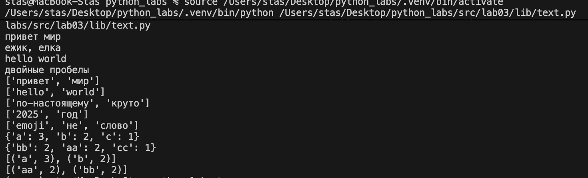
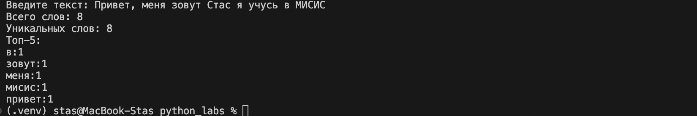

# Лабороторная работа 3

# Задание A
## normalize

```python
def normalize(text: str, *, casefold: bool = True, yo2e: bool = True) -> str:
    if text is None:
        raise ValueError
    if not isinstance(text, str):
        raise TypeError
    if len(text) == 0:
        return ""

    if casefold == True:
        text = text.casefold()

    if yo2e == True:
        text = text.replace('ё', 'е')
        text = text.replace('Ё', 'Е')
        text = text.replace('\t', ' ')
        text = text.replace('\r', ' ')
        text = text.replace('\n', ' ')
    text = ' '.join(text.split())
    text = text.strip()
    return text
```
## tokenize

```python
def tokenize(text: str) -> list[str]:
    trash = r'\w+(?:-\w+)*'
    token = re.findall(trash, text)
    return token
```
## count_freq

```python
def count_freq(tokens: list[str]) -> dict[str, int]:
    if not tokens:
        return {}
    freq_dict = {}
    for token in tokens:
        freq_dict[token] = freq_dict.get(token, 0) + 1
    return freq_dict
```

## top_N

```python
def top_n(freq: dict[str, int], n: int = 5) -> list[tuple[str, int]]:
    if not freq:
        return []
    items = list(freq.items())
    items.sort(key=lambda x: x[0])          
    items.sort(key=lambda x: x[1], reverse=True)
    return items[:n]
```

## Тест-кейсы

```python
print(tokenize("привет мир" ))
print(tokenize("hello,world!!!"))
print(tokenize("по-настоящему круто"))
print(tokenize("2025 год" ))
print(tokenize("emoji 😀 не слово" ))

print(count_freq(["a","b","a","c","b","a"]))
print(count_freq(["bb", "aa", "bb", "aa", "cc"]))

freq0 = {"a": 3, "b": 2, "c": 1}
print(top_n(freq0, 2))
freq1 = {"bb": 2, "aa": 2, "cc": 1}
print(top_n(freq1, 2))
```

## Вывод


# Задание B

```python
import sys
import os

sys.path.append(os.path.join(os.path.dirname(__file__), '..'))

from lib.text import normalize, tokenize, count_freq, top_n

def main():
    text = input('Введите текст: ')
    
    if not text.strip():
        raise ValueError('Нет текста')
    
    normalized_text = normalize(text, casefold=True, yo2e=True)
    tokens = tokenize(normalized_text)
    total_words = len(tokens)
    unique_words = len(set(tokens))
    freq = count_freq(tokens)
    top_words = top_n(freq, 5)
    
    print(f"Всего слов: {total_words}")
    print(f"Уникальных слов: {unique_words}")
    print("Топ-5:")
    for word, count in top_words:
        print(f"{word}:{count}")

if __name__ == "__main__":
    main()
```
## Вывод


# Общий вывод

В лабораторной №3 разработан текстовый анализатор с четырьмя основными функциями: нормализация, токенизация, подсчет частот и вывод топ-N слов. Программа text_stats.py анализирует ввод пользователя и показывает общую статистику: total слов, unique слов и 5 самых частых слов. Все модули протестированы и готовы к интеграции в будущие проекты.