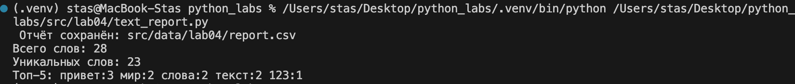

# Лабораторная работа №4

## Задание A
### Исходный код:
```python
from csv import writer
from pathlib import Path

def read_text(path: str, encoding: str = "utf-8") -> str:
    return Path(path).read_text(encoding=encoding)

def write_csv(rows: list, path: str, header: tuple = None) -> None:
    Path(path).parent.mkdir(parents=True, exist_ok=True)
    
    with open(path, 'w', newline='', encoding='utf-8') as f:
        w = writer(f)
        if header:
            w.writerow(header)
        w.writerows(rows)
```

### read_text() — читает любой текстовый файл и превращает в строку.
### write_csv() — сохраняет данные в CSV.

## Задание B
### Исходный код:
```python
import sys
from pathlib import Path

sys.path.insert(0, str(Path(__file__).parent.parent))

from lab04.io_txt_csv import read_text, write_csv
from lib.text import normalize, tokenize, count_freq, top_n

def main():
    input_file = "src/data/lab04/input.txt"  
    output_file = "src/data/lab04/report.csv"  
    
    try:
        text = read_text(input_file)
        freq = count_freq(tokenize(normalize(text)))
        write_csv(sorted(freq.items(), key=lambda x: (-x[1], x[0])), 
                 output_file, header=("word", "count"))
        
        print(f" Отчёт сохранён: {output_file}")
        print(f"Всего слов: {sum(freq.values())}")
        print(f"Уникальных слов: {len(freq)}")
        print("Топ-5:", *[f"{w}:{c}" for w, c in top_n(freq, 5)])
        
    except FileNotFoundError:
        print(f" Файл {input_file} не найден")
        sys.exit(1)
    except Exception as e:
        print(f" Ошибка: {e}")
        sys.exit(1)

if __name__ == "__main__":
    main()
```

## Вывод:

