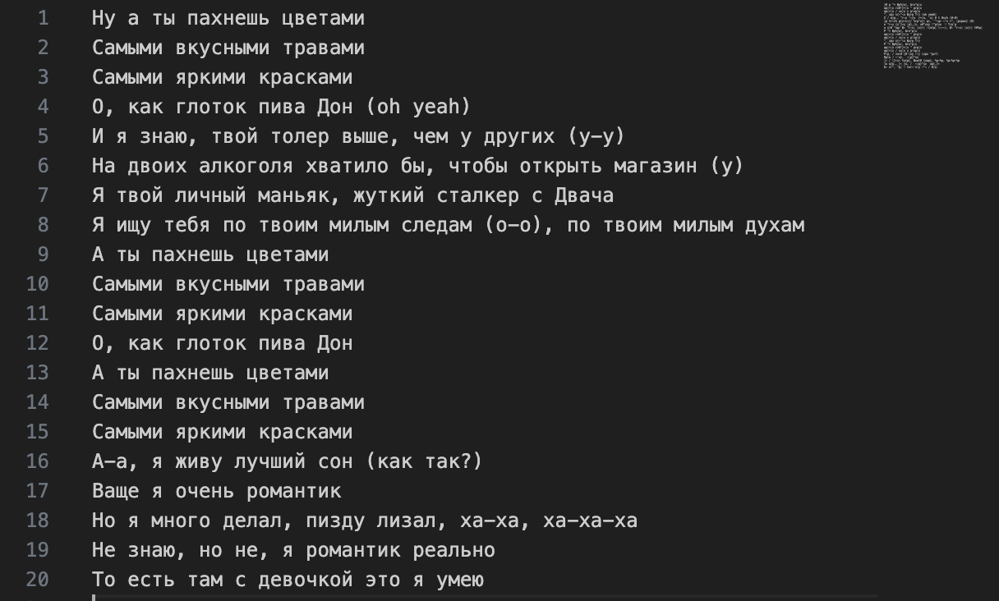
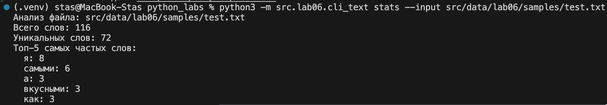
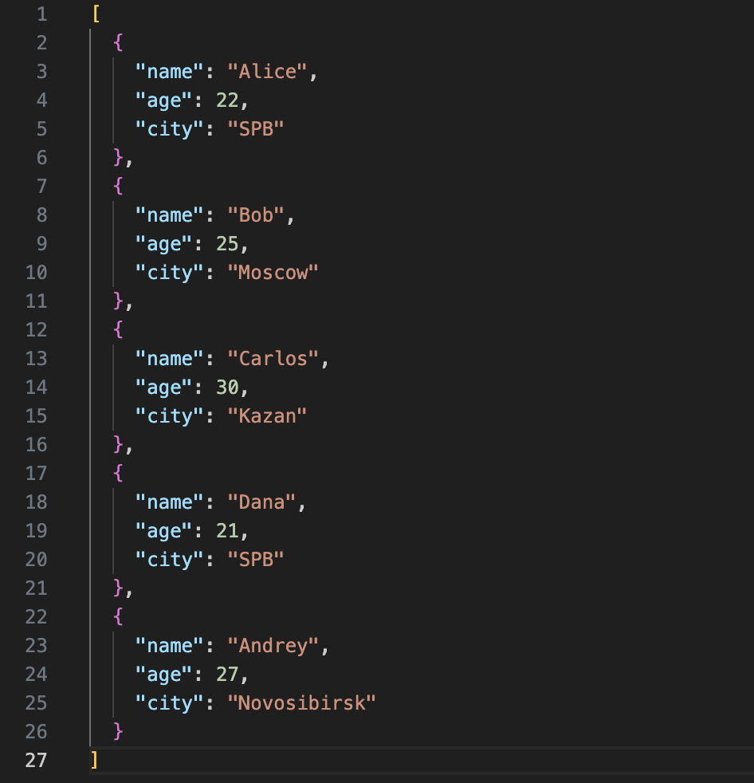
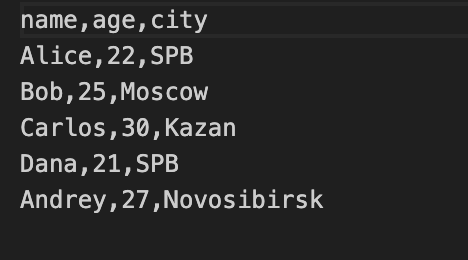
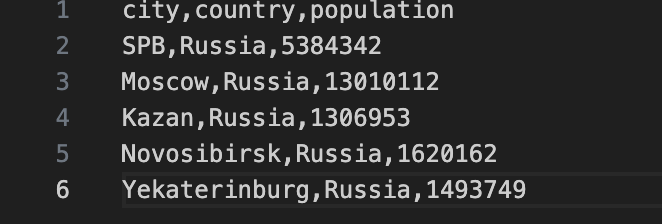
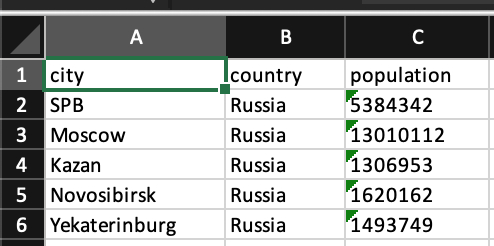

# Лабораторная работа 6: CLI‑утилиты с argparse

## Реализованные CLI‑утилиты

- Модуль `src/lab06/cli_text.py` с подкомандами:
  - `stats --input <txt> [--top 5]` — анализ частот слов в тексте;
  - `cat --input <path> [-n]` — вывод содержимого файла построчно (с нумерацией при `-n`).

- Модуль `src/lab06/cli_convert.py` с подкомандами:
  - `json2csv --in data/samples/people.json --out data/out/people.csv`  
  - `csv2json --in data/samples/people.csv --out data/out/people.json`  
  - `csv2xlsx --in data/samples/people.csv --out data/out/people.xlsx`

  ## Результаты выполнения

### cli_text

#### код:
```python
import argparse
import os
import sys

sys.path.append(os.path.join(os.path.dirname(__file__), '..', 'lab03'))

from text_stats import normalize, tokenize, count_freq, top_n

def validate_txt_file(filename):
    """Проверяет, что файл имеет расширение .txt"""
    if not filename.lower().endswith('.txt'):
        raise ValueError(f"Файл должен иметь расширение .txt: {filename}")

def cat_command(input_file, number_lines=False):
    try:
        validate_txt_file(input_file)
        
        with open(input_file, 'r', encoding='utf-8') as file:
            lines = file.readlines()
            
        for i, line in enumerate(lines, 1):
            if number_lines:
                print(f"{i:6d}\t{line.rstrip()}")
            else:
                print(line.rstrip())
                
    except FileNotFoundError:
        raise FileNotFoundError(f"Файл не найден: {input_file}")
    except Exception as e:
        raise Exception(f"Ошибка при чтении файла: {e}")

def stats_command(input_file, top_count=5):
    try:
        validate_txt_file(input_file)
        
        with open(input_file, 'r', encoding='utf-8') as file:
            text = file.read()
        
        if not text.strip():
            raise ValueError('Файл пуст')
        
        # Используем функции из lab03
        normalized_text = normalize(text, casefold=True, yo2e=True)
        tokens = tokenize(normalized_text)
        total_words = len(tokens)
        unique_words = len(set(tokens))
        freq = count_freq(tokens)
        top_words = top_n(freq, top_count)
        
        print(f"Анализ файла: {input_file}")
        print(f"Всего слов: {total_words}")
        print(f"Уникальных слов: {unique_words}")
        print(f"Топ-{top_count} самых частых слов:")
        for word, count in top_words:
            print(f"  {word}: {count}")
            
    except FileNotFoundError:
        raise FileNotFoundError(f"Файл не найден: {input_file}")
    except Exception as e:
        raise Exception(f"Ошибка при анализе текста: {e}")

def main():
    parser = argparse.ArgumentParser(
        description="CLI-утилита для работы с текстовыми файлами",
        formatter_class=argparse.RawDescriptionHelpFormatter
    )
    subparsers = parser.add_subparsers(dest="command", help="Доступные команды")

    cat_parser = subparsers.add_parser("cat", help="Вывести содержимое файла")
    cat_parser.add_argument("--input", required=True, help="Входной файл")
    cat_parser.add_argument("-n", action="store_true", help="Нумеровать строки")

    stats_parser = subparsers.add_parser("stats", help="Анализ частот слов в тексте")
    stats_parser.add_argument("--input", required=True, help="Входной текстовый файл")
    stats_parser.add_argument("--top", type=int, default=5, help="Количество топ-слов (по умолчанию: 5)")

    args = parser.parse_args()

    try:
        if args.command == "cat":
            cat_command(args.input, args.n)
        elif args.command == "stats":
            stats_command(args.input, args.top)
        else:
            parser.print_help()
            
    except FileNotFoundError as e:
        print(f"Ошибка: {e}", file=sys.stderr)
        sys.exit(1)
    except ValueError as e:
        print(f"Ошибка: {e}", file=sys.stderr)
        sys.exit(1)
    except Exception as e:
        print(f"Неожиданная ошибка: {e}", file=sys.stderr)
        sys.exit(1)

if __name__ == "__main__":
    main()
```
#### stats
```python
python3 -m src.lab06.cli_text stats --input src/data/lab06/samples/test.txt
```
#### Исходный текст  
   
#### Вывод:


### cli_convert

### код:
```python
import argparse
from pathlib import Path
import sys
import os

sys.path.append(os.path.join(os.path.dirname(__file__), "..", 'lab05'))

from json_csv import json_to_csv, csv_to_json
from csv_xlsx import csv_to_xlsx


def build_parser() -> argparse.ArgumentParser:
    parser = argparse.ArgumentParser(
        description="Конвертеры данных (JSON <-> CSV <-> XLSX)"
    )

    subparsers = parser.add_subparsers(
        dest="command",
        title="Команды",
        description="Доступные подкоманды: json2csv, csv2json, csv2xlsx",
    )

    # json2csv
    p1 = subparsers.add_parser("json2csv", help="- Конвертация JSON → CSV")
    p1.add_argument("--in", dest="input", required=True, help="Входной JSON-файл")
    p1.add_argument("--out", dest="output", required=True, help="Выходной CSV-файл")

    # csv2json
    p2 = subparsers.add_parser("csv2json", help="- Конвертация CSV → JSON")
    p2.add_argument("--in", dest="input", required=True, help="Входной CSV-файл")
    p2.add_argument("--out", dest="output", required=True, help="Выходной JSON-файл")

    # csv2xlsx
    p3 = subparsers.add_parser("csv2xlsx", help="- Конвертация CSV → XLSX")
    p3.add_argument("--in", dest="input", required=True, help="Входной CSV-файл")
    p3.add_argument("--out", dest="output", required=True, help="Выходной XLSX-файл")

    return parser


def main(argv=None):
    if argv is None:
        argv = sys.argv[1:]


    if not argv:
        print("CLI-конвертер данных (json2csv, csv2json, csv2xlsx)\n")
        print("Команды:")
        print("  json2csv  - Конвертация JSON → CSV")
        print("  csv2json  - Конвертация CSV → JSON")
        print("  csv2xlsx  - Конвертация CSV → XLSX\n")
        print("Использование:")
        print(
            "  python3 src/lab_06/cli_convert.py (json2csv/csv2json/csv2xlsx) --in data/samples/файл --out data/out/файл\n"
        )
        return

    # 2) Общий help
    if argv[0] in ("-h", "--help"):
        print("Справка по конвертерам данных\n")
        print("Команды:")
        print("  json2csv  - Конвертация JSON → CSV")
        print("  csv2json  - Конвертация CSV → JSON")
        print("  csv2xlsx  - Конвертация CSV → XLSX\n")
        print("Дополнительно:")
        print("  python3 src/lab_06/cli_convert.py json2csv --help")
        print("  python3 src/lab_06/cli_convert.py csv2json --help")
        print("  python3 src/lab_06/cli_convert.py csv2xlsx --help\n")
        return

    # 3) help  json2csv
    if argv[0] == "json2csv" and len(argv) > 1 and argv[1] in ("-h", "--help"):
        print("Справка по команде: json2csv\n")
        print("Назначение:")
        print("  Конвертация JSON → CSV\n")
        print("Параметры:")
        print("  --in или --input ПУТЬ    Входной JSON-файл")
        print("  --out или --output ПУТЬ   Выходной CSV-файл\n")
        print("Пример:")
        print(
            "  python3 src/lab_06/cli_convert.py json2csv --in data/samples/<filename>.json --out data/out/<filename>.csv\n"
        )
        return

    # 4) help  csv2json
    if argv[0] == "csv2json" and len(argv) > 1 and argv[1] in ("-h", "--help"):
        print("Справка по команде: csv2json\n")
        print("Назначение:")
        print("  Конвертация CSV → JSON\n")
        print("Параметры:")
        print("  --in или --input ПУТЬ    Входной CSV-файл")
        print("  --out или --output ПУТЬ   Выходной JSON-файл\n")
        print("Пример:")
        print(
            "  python3 src/lab_06/cli_convert.py csv2json --in data/samples/файл.csv --out data/out/файл.json\n"
        )
        return

    # 5) help  csv2xlsx
    if argv[0] == "csv2xlsx" and len(argv) > 1 and argv[1] in ("-h", "--help"):
        print("Справка по команде: csv2xlsx\n")
        print("Назначение:")
        print("  Конвертация CSV → XLSX (Excel)\n")
        print("Параметры:")
        print("  --in ПУТЬ    Входной CSV-файл")
        print("  --out ПУТЬ   Выходной XLSX-файл\n")
        print("Пример:")
        print(
            "  python3 src/lab_06/cli_convert.py csv2xlsx --in data/samples/файл.csv --out data/out/файл.xlsx\n"
        )
        return


    parser = build_parser()
    args = parser.parse_args(argv)

    try:
        if args.command == "json2csv":
            json_to_csv(args.input, args.output)
            print(f"Создан файл: {args.output}")

        elif args.command == "csv2json":
            csv_to_json(args.input, args.output)
            print(f"Создан файл: {args.output}")

        elif args.command == "csv2xlsx":
            csv_to_xlsx(args.input, args.output)
            print(f"Создан файл: {args.output}")

        else:
            print("Неизвестная команда. Используй --help.")
    except FileNotFoundError as e:
        print(f"Ошибка: файл не найден ({e})")
        sys.exit(1)


if __name__ == "__main__":
    main()
```
### json2csv
#### команда
```python
python3 src/lab06/cli_convert.py json2csv --in <входной_json> --out <выходной_csv>
```
### Ввод
  
### Вывод
  

### csv2json
#### команда
```python
python3 src/lab06/cli_convert.py csv2json --in <входной_csv> --out <выходной_json>
```
### Ввод
  
### Вывод
  

### csv2xlsx
#### команда
```python
python3 src/lab06/cli_convert.py csv2xlsx --in <входной_csv> --out <выходной_xlsx>
```
### Ввод
  
### Вывод
  


# Вывод
В ходе работы я успешно реализовал два CLI-модуля для обработки текстовых данных и конвертации форматов файлов.